## First microservices app
- in this project we will create our first microservices while diving deep into the architecture and its core components.
## Objectives
- creating the three essential components `discovery-service`, `gateway-service` and `config-service` and creating three microservices `customer-service`, `inventory-service` and `billing-service`, and see how communication is done between the services.

## Customer Service
### Dependencies
- We will create this service with the following dependencies

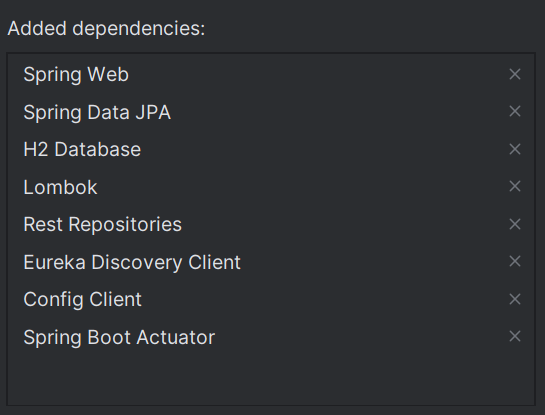

- The first dependencies are clear, the useful for creating a web service rapidly.
- `Eureka discovery client` would enable the microservice to get registered in the discovery service.
- `Config client` would help the microservice to connect with the configuration service in the run-time.

### Mundane Components
- After initializing the project we will create the core components for a microservice which are:
  - Entity class `Customer`.
  - Repository interface with spring data rest annotation `CustomerRepository`
  - H2 configuration in application.properties.
  - Insertion of dummy data in runtime using `CommandLineRunner`.

### Microservices configs
- We will set this configuration `spring.cloud.discovery.enabled=false` to not let the microservice register in discovery service because it is not ready yet.
- the same with configuration service. we will not register to it yet. `spring.cloud.config.enabled=false`

### Spring data rest
- We run our application and when we fetch the data of customers we see that it lack the ids. because spring data rest exclude it by default, we can however include it with projections, but there is a simpler way by creating a custom configuration.
```java
@Configuration
public class RestRepositoryConfig implements RepositoryRestConfigurer {
    @Override
    public void configureRepositoryRestConfiguration(RepositoryRestConfiguration config, CorsRegistry cors) {
        config.exposeIdsFor(Customer.class);
    }
}
```

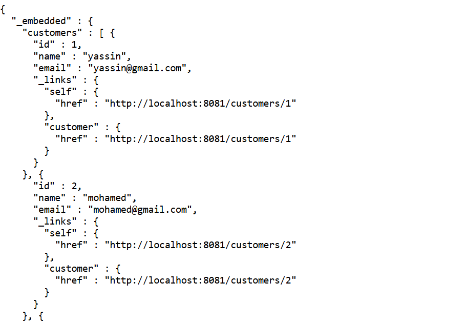

- After applying this configuration we will always get the ids, if we want to exclude it we need to create a projection. in our case we will create two one for all fields without the ids and one for only emails.
```java
@Projection(name = "all", types = Customer.class)
public interface CustomerProjection {
    String getName();
    String getEmail();
}

@Projection(name = "email", types = Customer.class)
public interface CustomerProjection2 {
    String getEmail();
}
```
- by default spring data rest uses the convention `http://localhost:port/classNameWithS`, but if we wanted to change the path we can specify it on application.properties.
```properties
spring.data.rest.base-path=/api
```
- `http://localhost:8081/customers` becomes `become http://localhost:8081/api/customers`.

### Actuator
- Actuator is a tool that could help us in monitoring the service as well as other things. for example kubernetes send pings to `http://host:port/actuator/health` to inspect the status of the service constantly. And the way the config service refresh another service is by sending a post request to `http://host:port/actuator/refresh`.
- By default, actuator return only one information which is `health` that indicate the status of the service either if it's up or down

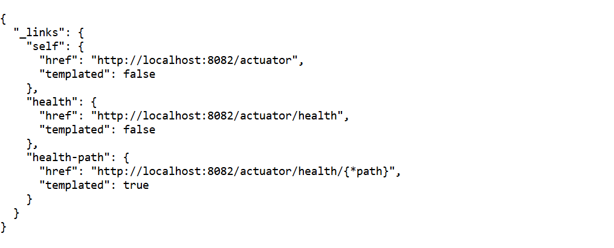

- We can return the other information by using the following property.
```properties
management.endpoints.web.exposure.include=*
```

- the same things we did with customer service will do it with inventory service with product as a model.

## Gateway service
- The gateway service will redirect the requests into the convenient service.
### Dependencies
- Just like the other service the gateway service needs `discovery client` dependency to connect with discovery service. as well as `actuator` to monitor and `config client` to connect with the configuration service.
- the new dependency here is the `gateway`.

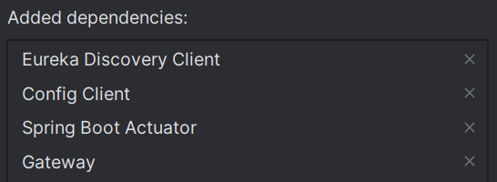

### Static approach
- `application.properties` is no longer enough. there is a better choice which is `application.yml` that enable us to write less and clearer.
- We will see two ways to add the services one is static and another dynamic.
- We will start with the static approach for now. where set an id for each service and specify their `uri` and `path`.
```yaml
spring:
  cloud:
    gateway:
      server:
        webmvc:
          routes:
            - id: r1
              uri: http://localhost:8081/
              predicates:
                Path= /api/customers/**
            - id: r2
              uri: http://localhost:8082/
              predicates:
                Path= /api/products/**
```
- Now we can access the microservices for the gateway.

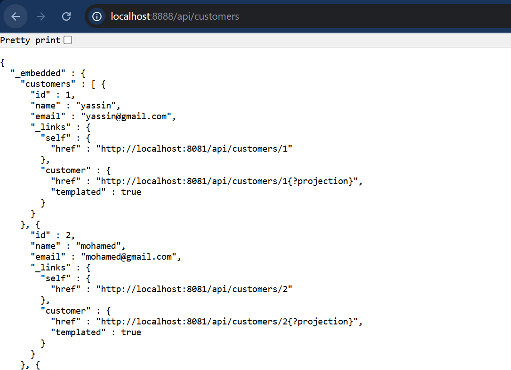

- the dynamic approach is done by checking the discovery service. however this is better because we don't actually know the addresses of the microservices.

## Discovery service

- We need one dependency for the discovery service which is eureka server

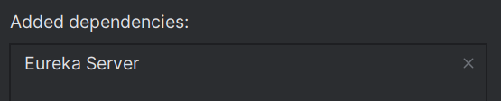

- We add the annotation `@EnableEurekaServer` to the application start method.
```java
@SpringBootApplication
@EnableEurekaServer
public class DiscoveryServiceApplication {
    public static void main(String[] args) {
        SpringApplication.run(DiscoveryServiceApplication.class, args);
    }
}
```
- we add the two properties
```properties

```

- When we visit `http://localhost:8761` we get the following page.

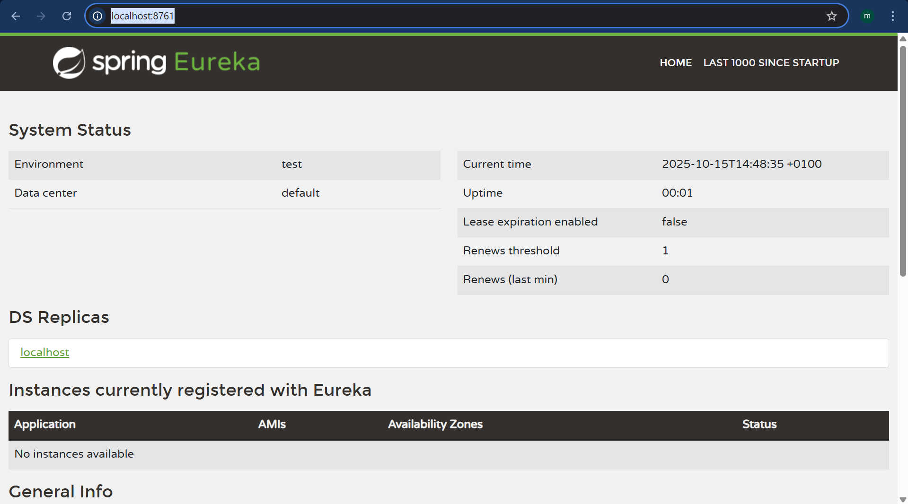

- There is no instance registered because we didn't yet register the services.
- We will register the microservices into the discovery service. to achieve that we need to add the following properties to the microservices.
```properties
# to enable the registration in discovery service (by discovery client dependency)
spring.cloud.discovery.enabled=true
# to specify the discovery service url, (this is the default property however)
eureka.client.service-url.defaultZone=http://localhost:8761/eureka
# by default, the microservice get registered by its name, we will change it to ip address
eureka.instance.prefer-ip-address=true
```
- These configurations properties are to be set on the gateway and all the microservices.
- at the end we can inspect the registered service as you see in the picture.

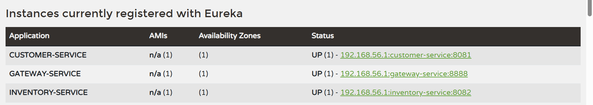

- In gateway service we can substitute the urls with `lb://service-name`, while the service name is the one in eureka panel.
```yaml
spring:
  cloud:
    gateway:
      server:
        webmvc:
          routes:
            - id: r1
              uri: lb://CUSTOMER-SERVICE
              predicates:
                Path= /api/customers/**
            - id: r2
              uri: lb://INVENTORY-SERVICE
              predicates:
                Path= /api/products/**
```
- And it will work just as before.

## Dynamic approach for registering services

- Now we will disable the file `application.yml` by changing its name and add the following method to application class.
```java
@Bean
DiscoveryClientRouteDefinitionLocator locator(
        ReactiveDiscoveryClient reactiveDiscoveryClient,
        DiscoveryLocatorProperties discoveryLocatorProperties
) {
    return new DiscoveryClientRouteDefinitionLocator(reactiveDiscoveryClient, discoveryLocatorProperties);
}
```
- The request must hold the microservice name which in the eureka panel just after the host and the port like the following.
```
http://localhost:8888/CUSTOMER-SERVICE/api/customers
```
- The name must be uppercase. but we can use the lowercase instead with the following property.
```properties
spring.cloud.gateway.server.webflux.discovery.locator.lower-case-service-id=true
```

## Billing service

### Dependencies

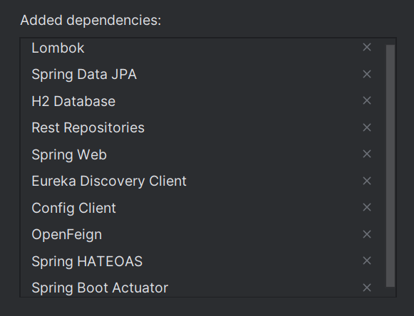

- There is some new dependencies here like openFeign that we'll use to communicate with other services using rest api.

### Service components

- As well as the previous services we will create the models which are `Bill` and `ProductItem`, but we will also create the models that we need from the other services but without `@Entity` annotation to tell spring not to save them. also, we'll add `@Transient` annotation to in the entities attribute to tell jpa not to consider them as persistence classes.

```java
@Entity
@Data
@Builder
@NoArgsConstructor
@AllArgsConstructor
public class Bill {
    @Id
    @GeneratedValue(strategy = GenerationType.IDENTITY)
    private Long id;
    private LocalDateTime billingDate;
    private long customerId;
    @OneToMany(mappedBy = "bill")
    private List<ProductItem> productItems = new ArrayList<ProductItem>();
    @Transient
    private Customer customer;
}

@Entity
@Getter
@Setter
@NoArgsConstructor
@AllArgsConstructor
@Builder
public class ProductItem {
    @Id
    @GeneratedValue(strategy = GenerationType.IDENTITY)
    private Long id;
    private String productId;
    @ManyToOne
    @JsonProperty(access = JsonProperty.Access.WRITE_ONLY)
    private Bill bill;
    private int quantity;
    private double unitPrice;
    @Transient
    private Product product;
}
```

### Feign client

- `openFeign` is a dependency that helps us to connect with other services using rest api.
- We create for each service an interface with the annotation `@FeignClient` and pass the name of the service as parameter.
- Inside the interface we define the methods with the get or post method annotation with the path of the rest api request.
```java
@FeignClient(name = "customer-service")
public interface CustomerRestClient {
    @GetMapping("/api/customers/{customerId}")
    Customer findCustomerById(@PathVariable Long customerId);

    @GetMapping("/api/customers")
    List<Customer> findAllCustomers();
}
```
- We need also to enable the feign clients processing in starter class with the annotation `@EnableFeignClients`.
```java
@SpringBootApplication
@EnableFeignClients
public class BillingServiceApplication {
    public static void main(String[] args) {
        SpringApplication.run(BillingServiceApplication.class, args);
    }
}
```
- Feign client dependency also create an instance of the interfaces with `@FeignClient` annotation. That means we can inject it and use it somewhere like spring data repositories.
- We will create a rest controller of bills to get the customers and the products from the other services, we are creating a get method.
```java
@RestController
@AllArgsConstructor
public class BillRestController {
    private BillRepository billRepository;
    private CustomerRestClient customerRestClient;
    private ProductRestClient productRestClient;

    @GetMapping("/bills/{id}")
    public Bill getBill(@PathVariable Long id) {
        Bill bill = billRepository.findById(id).get();
        bill.setCustomer(customerRestClient.findCustomerById(bill.getCustomerId()));
        bill.getProductItems().forEach(productItem -> {
            productItem.setProduct(productRestClient.getProductById(productItem.getProductId()));
        });
        return bill;
    }
}
```

## Configuration service

### Dependencies

- First thing first we create another module with the dependencies: `config server`, `actuator` and `eureka client`.

### Config repo

- We need to enable the config property in the starter class with the annotation `@@EnableConfigServer`.
```java
@SpringBootApplication
@EnableConfigServer
public class ConfigServiceApplication {
    public static void main(String[] args) {
        SpringApplication.run(ConfigServiceApplication.class, args);
    }
}
```
- The config service uses another repository git to manage the properties.
- we create another folder with its own git configuration.

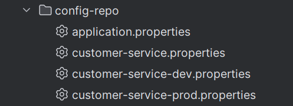

- we use the following property, for now we are using a local folder, but it still needs a git on it, if used a remote git repository we specify its link instead of the local folder.
```properties
spring.cloud.config.server.git.uri=file:///C:/Users/mouad/IdeaProjects/micro-services-app/config-repo
```
- We can inspect the configurations from the url.
```
http://localhost:9999/propertyFileName/default | dev | prod
```

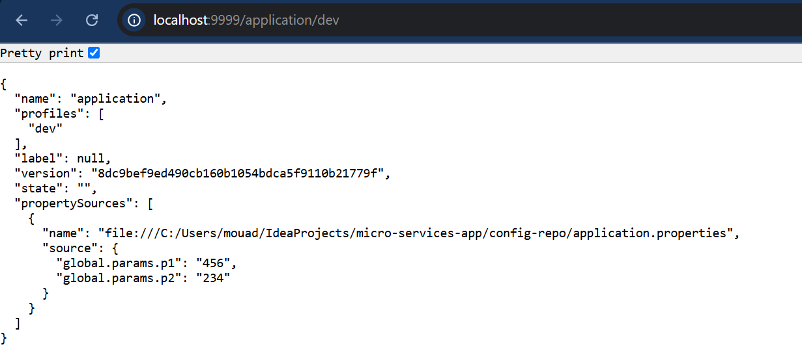

### Enable Config for the services
- We are taking customer service for example.
- We enable the property of config client in the microservice.
- We add new property `spring.config.import` where we put the link of the config service.
```properties
spring.cloud.config.enabled=true
spring.config.import=optional:configserver:http://localhost:9999
```
- we create a rest controller to test the configs we are importing.
```java
@RestController
public class ConfigTestRestController {
    @Value("${global.params.p1}")
    private String p1;
    @Value("${global.params.p2}")
    private String p2;

    @GetMapping("/testConfig1")
    public Map<String , String> configTest() {
        return Map.of("p1", p1, "p2", p2);
    }
}
```

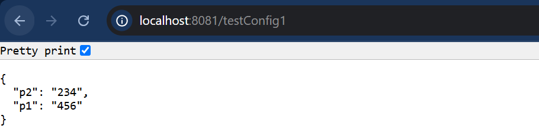

- There is another method which is to get the config parameters in runtime. we use a record with the annotation `@ConfigurationProperties(prefix = "param.param")`.
```java
@ConfigurationProperties(prefix = "customer.params")
public record CustomerConfigParam(int x, int y) {
}
```
- But we need to enable it in starter class with the annotation `@EnableConfigurationProperties(ConfigRecordName.class)`.
```java
@SpringBootApplication
@EnableConfigurationProperties(CustomerConfigParam.class)
public class CustomerServiceApplication {
    public static void main(String[] args) {
        SpringApplication.run(CustomerServiceApplication.class, args);
    }
}
```
- We add another method in the controller to test this method.
```java
@GetMapping("/testConfig2")
public CustomerConfigParam configTest2() {
    return customerConfigParam;
}
```

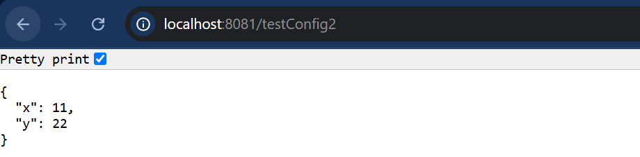

### Refresh the configuration

- If we want the service to refresh after changing the configurations we need it to have the property of actuator `management.endpoints.web.exposure.include=refresh` and the controller should have the annotation `@RefreshScope` which tells spring to reinitialize the controller after being refreshed.
```java
@RestController
@RefreshScope
public class ConfigTestRestController {
    @Value("${global.params.p1}")
    private String p1;
    @Value("${global.params.p2}")
    private String p2;
    ...
}
```
- After changing the configurations we make a new commit and send a POST request to `http://localhost:portService/actuator/refresh`.
- And then the service refresh the configuration.
- Now if we take the configurations from the local `application.property` to `customer-service.property` in the config repo, it will work smoothly.
- We do it with all the services except gateway service.

### Put the configuration into a remote repository

- Now we will create a GitHub repository for the config repo.

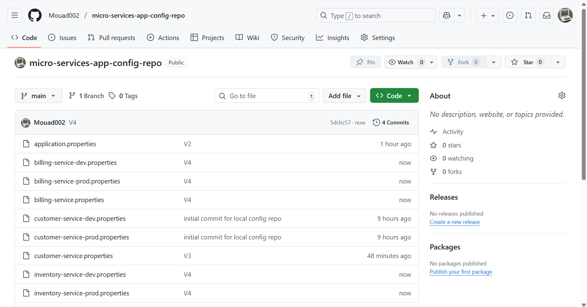

- Then we clean the configuration files and gather the common ones in `application.properties`.


